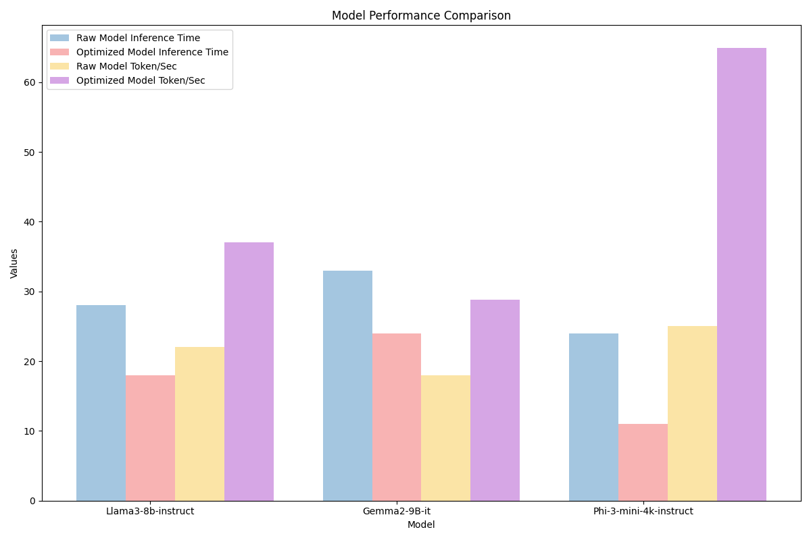

# SandLogic Lexicons

Welcome to the SandLogic Lexicons, your premier destination for optimized Large Language Models (LLMs) ready for immediate deployment across a variety of hardware platforms. Our repository is designed to bridge the gap between cutting-edge AI research and practical, real-world applications.

## Overview

The SandLogic Lexicons houses a comprehensive collection of pre-trained and fine-tuned LLMs, meticulously optimized for superior performance and efficiency. Our models are engineered to run seamlessly on both GPU and CPU architectures, democratizing access to advanced natural language processing capabilities. Our aim is to facilitate the spread and usage of Large Language Models (LLM) among a wider audience of developers, researchers, and enthusiasts. 
## Key Features

### 1. Optimized Performance

All models in our Lexicons  undergo rigorous optimization processes to ensure peak performance across diverse hardware configurations. Whether you're running on high-end GPUs or commodity CPUs, our models deliver exceptional results without compromising on efficiency.

### 2. Advanced Quantization Techniques

We employ state-of-the-art quantization methods to reduce the model size and increase inference speed without significant loss in accuracy. Our offerings include:

- Legacy quantization techniques (e.g., Q5_K_M, Q4_K_M)
- Cutting-edge imatrix quants (e.g., IQ4_XS)

These quantization approaches allow for deploying powerful models on resource-constrained devices, enabling edge AI applications.

### 3. Benchmark-Validated Performance

Each model in our Lexicons  is rigorously evaluated on standard industry benchmarks, including:

- HellaSwag: A challenging commonsense reasoning task that tests a model's ability to complete scenarios with plausible endings.

-  MMLU (Massive Multitask Language Understanding): A comprehensive benchmark covering 57 subjects across STEM, humanities, and social sciences to evaluate a model's multitask capabilities.

-  CodeXGLUE Code2Text: Assesses a model's ability to generate natural language descriptions from source code snippets.

-  Winogrande: A large-scale dataset for testing commonsense reasoning, based on the Winograd Schema Challenge.

-  MedMCQA: A multiple-choice question answering dataset designed to evaluate medical knowledge and reasoning.

-  MMLU Clinical Knowledge: A subset of MMLU focusing specifically on clinical knowledge, testing a model's understanding of medical concepts and practices.

These benchmarks provide a comprehensive evaluation of our models' performance across various domains, including general knowledge, reasoning, coding, and specialized medical understanding.


## Documentation

For in-depth information on our quantization techniques and methodologies, please refer to our [Quantization Guide](Docs/Quantization/quantization.md).

To learn more about our benchmark evaluation processes and results, check out our [Benchmark Documentation](Docs/BenchmarkEvaluation/benchmark.md).

To know about the models considered for quantization you can click on the below link -
1. [Meta-Llama-3-8B-Instruct](Models/Meta-Llama-3-8B-Instruct/Llama3.md)
2. [Phi-3-mini-4k-instruct](Models/Phi-3.1-mini-4k-instruct/Phi3.1.md)
3. [Gemma-2-9b-it](Models/Gemma-2-9b-it/Gemma.md)
4. [Nxcode-CQ-7B-orpo](Models/Nxcode-CQ-7B-orpo/Nxcode.md)
5. [Llama3-Med42-8B](Models/Llama3-Med42-8B/Llama3Med42.md)
6. [Llama3-Hindi-8B](Models/LLama3-Gaja-Hindi-8B/GajaHindi.md)
7. [SmolLM-1.7B-Instruct](Models/SmolLM-1.7B-Instruct/Smollm1.7b.md)
8. [Llama-3-sqlcoder-8b](Models/Llama-3-sqlcoder-8b/llama3Sqlcoder.md)

## Model Performance Comparison


This  graph provides a comparative analysis of model performance across different metrics, including raw and optimized inference times, as well as token generation rates. The inference was conducted on a Tesla T4 GPU with the task of generating 600 tokens for a storytelling application. The bar graph highlights the efficiency improvements and token generation capabilities of each model, offering valuable insights into their relative performance.

## Models 


This table provides a comparison of various quantized models, detailing their bit configurations, original sizes, token/second, and quantized sizes.
The token/second has been calculated on a task for generating 512 tokens on an Nvidia GeForce RTX 2060.

| Models                   | Bits          | Original size | Quantized size | Token/second | Download Links                                                                                                                          |
|--------------------------|---------------|---------------|----------------|--------------|-----------------------------------------------------------------------------------------------------------------------------------------|
| Meta-Llama-3-8B-Instruct | 5 bit         | 16 GB         | 5.73 GB        | 41           | [Click here](https://huggingface.co/SandLogicTechnologies/Meta-Llama-3-8B-Instruct-GGUF/blob/main/Meta-Llama-3-8B-Instruct.Q5_K_M.gguf) |
| Meta-Llama-3-8B-Instruct | Imatrix 4 bit | 16 GB         | 4.45 GB        | 41           | [Click here](https://huggingface.co/SandLogicTechnologies/Meta-Llama-3-8B-Instruct-GGUF/blob/main/Meta-Llama-3-8B-Instruct.IQ4_XS.gguf) |
| Meta-Llama-3-8B-Instruct | 4 bit         | 16 GB         | 4.92 GB        | 41           | [Click here](https://huggingface.co/SandLogicTechnologies/Meta-Llama-3-8B-Instruct-GGUF/blob/main/Meta-Llama-3-8B-Instruct.Q4_K_M.gguf) |
| Phi-3-mini-4k-instruct   | 5 bit         | 8 GB          | 2.82 GB        | 74           | [Click here](https://huggingface.co/SandLogicTechnologies/Phi-3.1-mini-4k-instruct-GGUF/blob/main/Phi-3.1-mini-4k-instruct-Q5_K_M.gguf) |
| Phi-3-mini-4k-instruct   | Imatrix 4 bit | 8 GB          | 2.06 GB        | 74           | [Click here](https://huggingface.co/SandLogicTechnologies/Phi-3.1-mini-4k-instruct-GGUF/blob/main/Phi-3.1-mini-4k-instruct-IQ4_XS.gguf) |
| Phi-3-mini-4k-instruct   | 4 bit         | 8 GB          | 2.39 GB        | 74           | [Click here](https://huggingface.co/SandLogicTechnologies/Phi-3.1-mini-4k-instruct-GGUF/blob/main/Phi-3.1-mini-4k-instruct-Q4_K_M.gguf) |
| Gemma-2-9b-it            | 5 bit         | 19 GB         | 6.65 GB        | 27           | [Click here](https://huggingface.co/SandLogicTechnologies/Gemma-2-9b-it-GGUF/blob/main/gemma-2-9b-it-Q5_K_M.gguf)                       |
| Gemma-2-9b-it            | Imatrix 4 bit | 19 GB         | 5.76 GB        | 27           | [Click here](https://huggingface.co/SandLogicTechnologies/Gemma-2-9b-it-GGUF/blob/main/gemma-2-9b-it-IQ4_XS.gguf)                       |
| Gemma-2-9b-it            | 4 bit         | 19 GB         | 5.18 GB        | 27           | [Click here](https://huggingface.co/SandLogicTechnologies/Gemma-2-9b-it-GGUF/blob/main/gemma-2-9b-it-Q4_K_M.gguf)                       |
| Nxcode-CQ-7B-orpo        | 5 bit         | 14.5 GB       | 5.43 GB        | 12           | [Click here](https://huggingface.co/SandLogicTechnologies/Nxcode-CQ-7B-orpo-GGUF/blob/main/Nxcode-CQ-7B-orpo-Q5_K_M.gguf)               |
| Nxcode-CQ-7B-orpo        | 4 bit         | 14.5 GB       | 4.74 GB        | 12           | [Click here](https://huggingface.co/SandLogicTechnologies/Nxcode-CQ-7B-orpo-GGUF/blob/main/Nxcode-CQ-7B-orpo-Q4_K_M.gguf)               |
| Llama3-Med42-8B          | 5 bit         | 16.07 GB      | 5.34 GB        | 12           | [Click here](https://huggingface.co/SandLogicTechnologies/Llama3-Med42-8B-GGUF/blob/main/Llama3-Med42-8B-Q5_K_M.gguf)                   |
| Llama3-Med42-8B          | 4 bit         | 16.07 GB      | 4.58 GB        | 39           | [Click here](https://huggingface.co/SandLogicTechnologies/Llama3-Med42-8B-GGUF/blob/main/Llama3-Med42-8B-Q4_K_M.gguf)                   |
| Llama3-Hindi-8B          | 5 bit         | 16.07 GB      | 5.34 GB        | 39           | [Click here](https://huggingface.co/SandLogicTechnologies/LLama3-Gaja-Hindi-8B-GGUF/blob/main/LLama3-Gaja-Hindi-8B-v0.1-Q5_K_M.gguf)    |
| Llama3-Hindi-8B          | 4 bit         | 16.07 GB      | 4.58 GB        | 39           | [Click here](https://huggingface.co/SandLogicTechnologies/LLama3-Gaja-Hindi-8B-GGUF/blob/main/llama3-gaja-hindi-8b-v0.1.Q4_K_M.gguf)    |
| SmolLM-1.7B-Instruct     | 5 bit         | 3.42 GB       | 1.23 GB        | 144          | [Click here](https://huggingface.co/SandLogicTechnologies/SmolLM-1.7B-Instruct-GGUF/blob/main/SmolLM-1.7B-Instruct.Q5_K_M.gguf)         |
| SmolLM-1.7B-Instruct     | Imatrix 4 bit | 3.42 GB       | 948 MB         | 144          | [Click here](https://huggingface.co/SandLogicTechnologies/SmolLM-1.7B-Instruct-GGUF/blob/main/SmolLM-1.7B-Instruct.IQ4_XS.gguf)         |
| SmolLM-1.7B-Instruct     | 4 bit         | 3.42 GB       | 1.06 GB        | 144          | [Click here](https://huggingface.co/SandLogicTechnologies/SmolLM-1.7B-Instruct-GGUF/blob/main/SmolLM-1.7B-Instruct.Q4_K_M.gguf)         |
| Llama-3-Sqlcoder-8B      | 5 bit         | 16 GB         | 5.73 GB        | 37           | [Click here](https://huggingface.co/SandLogicTechnologies/Llama-3-Sqlcoder-8B-GGUF/blob/main/llama-3-sqlcoder-8b.Q5_K_M.gguf)           |
| Llama-3-Sqlcoder-8B      | 4 bit         | 16 GB         | 4.92 GB        | 37           | [Click here](https://huggingface.co/SandLogicTechnologies/Llama-3-Sqlcoder-8B-GGUF/blob/main/llama-3-sqlcoder-8b.Q4_K_M.gguf)           |


## Inference

Our Model Zoo supports efficient inference using the `llama-cpp-python` package. This allows you to run our quantized models on both CPU and GPU with minimal setup.

For detailed instructions on installation, usage examples, and advanced configurations, please refer to our [Inference Guide](Scripts/Inference.md).
### Quick Start with Ollama

Experience the power of our quantized models with just a single line of code using Ollama. Access our optimized models at:

[https://ollama.com/SL-Lexicons](https://ollama.com/SL-Lexicons)

Run any of our quantized models effortlessly and explore their capabilities within seconds!

## License

This repository and all its contents are licensed under the [MIT License](https://opensource.org/licenses/MIT). By using the SandLogic Lexicons, you agree to the terms and conditions of this license. 
 
``` 
MIT License 
 
Copyright (c) 2024 SandLogic 
 
Permission is hereby granted, free of charge, to any person obtaining a copy of this software and associated documentation files (the "Software"), to deal in the Software without restriction, including without limitation the rights to use, copy, modify, merge, publish, distribute, sublicense, and/or sell copies of the Software, and to permit persons to whom the Software is furnished to do so, subject to the following conditions: 
 
The above copyright notice and this permission notice shall be included in all copies or substantial portions of the Software. 
 
THE SOFTWARE IS PROVIDED "AS IS", WITHOUT WARRANTY OF ANY KIND, EXPRESS OR IMPLIED, INCLUDING BUT NOT LIMITED TO THE WARRANTIES OF MERCHANTABILITY, FITNESS FOR A PARTICULAR PURPOSE AND NONINFRINGEMENT. IN NO EVENT SHALL THE AUTHORS OR COPYRIGHT HOLDERS BE LIABLE FOR ANY CLAIM, DAMAGES OR OTHER LIABILITY, WHETHER IN AN ACTION OF CONTRACT, TORT OR OTHERWISE, ARISING FROM, OUT OF OR IN CONNECTION WITH THE SOFTWARE OR THE USE OR OTHER DEALINGS IN THE SOFTWARE. 
``` 
 

## Contact

For any inquiries or support, please contact us at support@sandlogic.com or visit our [Website](https://www.sandlogic.com/). 
Join our discord server [SandLogic Lexicon](https://discord.gg/qsVUe9m9)
## Acknowledgments

We would like to express our gratitude to the following projects and organizations for their invaluable contributions to the field of AI and for making their work available to the community:

1. [llama.cpp](https://github.com/ggerganov/llama.cpp) - For providing an efficient C/C++ implementation of LLM inference, which we use for model conversion and quantization.

2. [Hugging Face](https://huggingface.co/) - The Hugging Face Hub is a valuable resource for sharing and accessing state-of-the-art machine learning models, reflecting their commitment to open-source development and democratizing AI. Their tools and libraries greatly simplify working with large language models.
3. [Meta AI](https://ai.meta.com/) - For developing and releasing the Llama 3 model, pushing the boundaries of large language models.

4. [Google AI](https://ai.google/) - For creating the Gemma 2 model and contributing to the advancement of open-source AI.

5. [Microsoft Research](https://www.microsoft.com/en-us/research/) - For their work on the Phi-3 model, furthering the capabilities of smaller, more efficient language models.


These projects have been instrumental in our work, and we are thankful for their contributions to the open-source AI community.

## Citation
If you use this repository in your research or projects, please cite it as follows:

SandLogic-Lexicon. (2024). _SandLogic-Lexicon GitHub Repository_. Retrieved from [https://www.sandlogic.com/](https://www.sandlogic.com/) 

